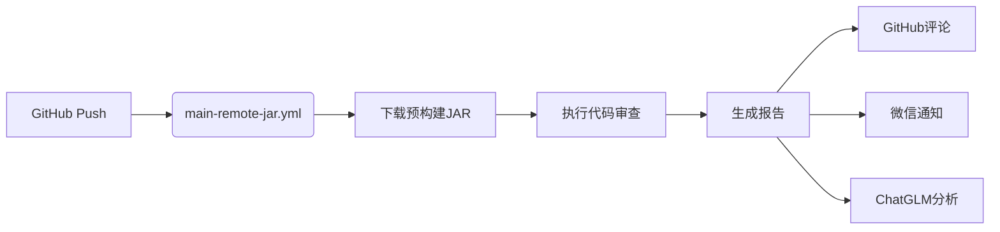

### 代码评审报告

#### 1. **GitHub Actions 工作流变更分析**
**文件变更**：
- `.github/workflows/main-maven-jar.yml`：分支触发条件从 `master` 改为 `master-close`
- 新增 `.github/workflows/main-remote-jar.yml`

**评审意见**：
- **优点**：
  - 新增的 `main-remote-jar.yml` 实现了预构建JAR的自动化代码审查，简化了CI流程
  - 使用 `wget` 直接下载发布版JAR，避免重复构建，提高效率
  - 环境变量配置清晰，包含GitHub/微信/ChatGLM等多平台集成

- **风险与改进建议**：
  - **安全性问题**：
    ```diff
    - 使用 wget 下载外部JAR存在安全风险
    ```
    **建议**：添加SHA校验：
    ```yaml
    - name: Download and verify JAR
      run: |
        wget -O ./libs/openai-code-review-sdk-1.0.jar https://github.com/Xenofon0831/openai-code-review-log/releases/download/v1.0/openai-code-review-sdk-1.0.jar
        wget -O ./libs/checksum.sha256 https://github.com/Xenofon0831/openai-code-review-log/releases/download/v1.0/openai-code-review-sdk-1.0.sha256
        sha256sum -c ./libs/checksum.sha256
    ```

  - **版本硬编码问题**：
    ```diff
    - 硬编码版本号 `1.0` 导致维护困难
    ```
    **建议**：使用环境变量：
    ```yaml
    env:
      SDK_VERSION: 1.0
    - name: Download JAR
      run: wget -O ./libs/openai-code-review-sdk-${{ env.SDK_VERSION }}.jar ...
    ```

  - **调试信息泄露**：
    ```diff
    - 打印敏感信息（提交作者、消息）到日志
    ```
    **建议**：移除调试步骤或使用加密日志：
    ```yaml
    - name: Print debug info
      if: env == 'development'
      run: |
        echo "Repository: ${{ env.REPO_NAME }}"
        echo "Branch: ${{ env.BRANCH_NAME }}"
    ```

---

#### 2. **Maven 依赖配置分析**
**文件变更**：
- 新增 `openai-code-review-sdk/dependency-reduced-pom.xml`

**评审意见**：
- **优点**：
  - 使用 `maven-shade-plugin` 创建可执行JAR，包含所有依赖
  - 依赖范围配置合理（`provided`避免冲突）

- **关键问题**：
  - **Java版本不兼容**：
    ```xml
    <properties>
      <java.version>1.8</java.version> <!-- 与JDK 11不匹配 -->
    </properties>
    ```
    **建议**：统一版本：
    ```xml
    <properties>
      <java.version>11</java.version> <!-- 与GitHub Actions一致 -->
    </properties>
    ```

  - **依赖版本冲突**：
    ```xml
    <dependency>
      <groupId>com.google.guava</groupId>
      <artifactId>guava</artifactId>
      <version>32.1.2-jre</version> <!-- 需Java 17+ -->
    </dependency>
    ```
    **建议**：降级到Java 8兼容版本：
    ```xml
    <version>30.1.1-jre</version> <!-- 最后支持Java 8的版本 -->
    ```

  - **shade插件配置缺失**：
    ```diff
    - 缺少资源过滤配置，可能导致配置文件未生效
    ```
    **建议**：添加资源处理：
    ```xml
    <build>
      <resources>
        <resource>
          <directory>src/main/resources</directory>
          <filtering>true</filtering>
        </resource>
      </resources>
    </build>
    ```

---

#### 3. **架构设计评审**
**整体设计**：


**优化建议**：
1. **解耦设计**：
   - 当前工作流承担下载/执行/通知三重职责
   **建议**：拆分为独立工作流：
   ```yaml
   # .github/workflows/build-sdk.yml
   # 仅负责构建和发布JAR

   # .github/workflows/run-review.yml
   # 仅负责执行审查和通知
   ```

2. **错误处理增强**：
   ```yaml
   - name: Run Code Review
     run: java -jar ...
     continue-on-error: false
     timeout-minutes: 10
     env:
       # ...现有环境变量
   ```

3. **缓存优化**：
   ```yaml
   - name: Cache JAR
     uses: actions/cache@v3
     with:
       path: ./libs/
       key: ${{ runner.os }}-sdk-${{ env.SDK_VERSION }}
   ```

---

#### 4. **安全与合规建议**
1. **Secret管理**：
   - 当前使用GitHub Secrets存储敏感信息
   **建议**：使用GitHub Secrets Groups进行分类管理

2. **权限最小化**：
   ```yaml
   permissions:
      contents: read
      pull-requests: write
      issues: write
   ```

3. **依赖扫描**：
   ```yaml
   - name: Run Dependency Check
     uses: actions/checkout@v3
     with:
       args: mvn org.owasp:dependency-check-maven:check
   ```

---

### 总结
**核心优势**：
1. 预构建JAR方案显著提升CI效率
2. 多平台集成（GitHub/微信/ChatGLM）覆盖完整场景
3. Maven shade插件实现自包含部署

**关键改进项**：
1. **紧急修复**：统一Java版本（1.8→11）和依赖兼容性
2. **安全加固**：添加JAR校验和敏感信息脱敏
3. **架构优化**：拆分工作流职责，增强错误处理
4. **维护性提升**：使用环境变量管理版本，添加依赖扫描

**优先级**：
- 🔴 **高**：Java版本兼容性问题（导致运行时失败）
- 🟡 **中**：安全加固和架构解耦
- 🟢 **低**：日志优化和缓存改进

> 注：建议在修复Java版本问题后进行回归测试，确保在JDK 11环境下所有依赖（尤其是guava）正常工作。